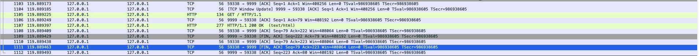

# Socket
## Goal
In this case, we need create a c program which could run like the Node.js Program [net.js](./net.js).

## Some step

### 1. [socket](./socket.c)


```console
COMMAND   PID         USER   FD   TYPE             DEVICE SIZE/OFF     NODE NAME
a.out   19064 xujunyu.joey  cwd    DIR                1,4      224 16150717 /Users/xujunyu.joey/learn-series/learn-c/c-features/io-lesson
a.out   19064 xujunyu.joey  txt    REG                1,4     8768 16207215 /Users/xujunyu.joey/learn-series/learn-c/c-features/io-lesson/a.out
a.out   19064 xujunyu.joey  txt    REG                1,4   973824 11797810 /usr/lib/dyld
a.out   19064 xujunyu.joey    0u   CHR               16,5    0t584     1193 /dev/ttys005
a.out   19064 xujunyu.joey    1u   CHR               16,5    0t584     1193 /dev/ttys005
a.out   19064 xujunyu.joey    2u   CHR               16,5    0t584     1193 /dev/ttys005
a.out   19064 xujunyu.joey    3u  IPv4 0x8b2eeaff8c74431f      0t0      TCP *:* (CLOSED)
```

open the fd and listened none address.

### 2. [setsockopt](./setsockopt.c)

```console
COMMAND   PID         USER   FD   TYPE             DEVICE SIZE/OFF     NODE NAME
a.out   19521 xujunyu.joey  cwd    DIR                1,4      320 16150717 /Users/xujunyu.joey/learn-series/learn-c/c-features/io-lesson
a.out   19521 xujunyu.joey  txt    REG                1,4     8840 16207778 /Users/xujunyu.joey/learn-series/learn-c/c-features/io-lesson/a.out
a.out   19521 xujunyu.joey  txt    REG                1,4   973824 11797810 /usr/lib/dyld
a.out   19521 xujunyu.joey    0u   CHR               16,5   0t1364     1193 /dev/ttys005
a.out   19521 xujunyu.joey    1u   CHR               16,5   0t1364     1193 /dev/ttys005
a.out   19521 xujunyu.joey    2u   CHR               16,5   0t1364     1193 /dev/ttys005
a.out   19521 xujunyu.joey    3u  IPv4 0x8b2eeaff8e36469f      0t0      TCP *:* (CLOSED)
```

Nothing changed.

### 3. [bind](./bind.c)
```console
COMMAND   PID         USER   FD   TYPE             DEVICE SIZE/OFF     NODE NAME
a.out   19854 xujunyu.joey  cwd    DIR                1,4      320 16150717 /Users/xujunyu.joey/learn-series/learn-c/c-features/io-lesson
a.out   19854 xujunyu.joey  txt    REG                1,4     9068 16207991 /Users/xujunyu.joey/learn-series/learn-c/c-features/io-lesson/a.out
a.out   19854 xujunyu.joey  txt    REG                1,4   973824 11797810 /usr/lib/dyld
a.out   19854 xujunyu.joey    0u   CHR               16,5   0t2528     1193 /dev/ttys005
a.out   19854 xujunyu.joey    1u   CHR               16,5   0t2528     1193 /dev/ttys005
a.out   19854 xujunyu.joey    2u   CHR               16,5   0t2528     1193 /dev/ttys005
a.out   19854 xujunyu.joey    3u  IPv4 0x8b2eeaff6f077d1f      0t0      TCP localhost:distinct (CLOSED)
```

It bind the local address now


### 4. [listen](./listen.c)
```console
COMMAND   PID         USER   FD   TYPE             DEVICE SIZE/OFF     NODE NAME
a.out   20702 xujunyu.joey  cwd    DIR                1,4      352 16150717 /Users/xujunyu.joey/learn-series/learn-c/c-features/io-lesson
a.out   20702 xujunyu.joey  txt    REG                1,4     9116 16209263 /Users/xujunyu.joey/learn-series/learn-c/c-features/io-lesson/a.out
a.out   20702 xujunyu.joey  txt    REG                1,4   973824 11797810 /usr/lib/dyld
a.out   20702 xujunyu.joey    0u   CHR               16,8  0t88797     1191 /dev/ttys008
a.out   20702 xujunyu.joey    1u   CHR               16,8  0t88797     1191 /dev/ttys008
a.out   20702 xujunyu.joey    2u   CHR               16,8  0t88797     1191 /dev/ttys008
a.out   20702 xujunyu.joey    3u  IPv4 0x8b2eeaff8104299f      0t0      TCP localhost:distinct (LISTEN)
```


### 5. [listen](./listen.c)
```console
COMMAND   PID         USER   FD   TYPE             DEVICE SIZE/OFF     NODE NAME
a.out   20702 xujunyu.joey  cwd    DIR                1,4      352 16150717 /Users/xujunyu.joey/learn-series/learn-c/c-features/io-lesson
a.out   20702 xujunyu.joey  txt    REG                1,4     9116 16209263 /Users/xujunyu.joey/learn-series/learn-c/c-features/io-lesson/a.out
a.out   20702 xujunyu.joey  txt    REG                1,4   973824 11797810 /usr/lib/dyld
a.out   20702 xujunyu.joey    0u   CHR               16,8  0t88797     1191 /dev/ttys008
a.out   20702 xujunyu.joey    1u   CHR               16,8  0t88797     1191 /dev/ttys008
a.out   20702 xujunyu.joey    2u   CHR               16,8  0t88797     1191 /dev/ttys008
a.out   20702 xujunyu.joey    3u  IPv4 0x8b2eeaff8104299f      0t0      TCP localhost:distinct (LISTEN)
```

and we run the `curl 127.0.0.1:9999`. By the `Wireshark`, we could see the TCP connection is built.  


and we try `lsof -c a.out` again, there is no change.


### 5. [accept](./accept.c)
we could see the client_fd has been opened.
```console
COMMAND   PID         USER   FD   TYPE             DEVICE SIZE/OFF     NODE NAME
a.out   21702 xujunyu.joey  cwd    DIR                1,4      448 16150717 /Users/xujunyu.joey/learn-series/learn-c/c-features/io-lesson
a.out   21702 xujunyu.joey  txt    REG                1,4     9204 16210949 /Users/xujunyu.joey/learn-series/learn-c/c-features/io-lesson/a.out
a.out   21702 xujunyu.joey  txt    REG                1,4   973824 11797810 /usr/lib/dyld
a.out   21702 xujunyu.joey    0u   CHR               16,8  0t92080     1191 /dev/ttys008
a.out   21702 xujunyu.joey    1u   CHR               16,8  0t92080     1191 /dev/ttys008
a.out   21702 xujunyu.joey    2u   CHR               16,8  0t92080     1191 /dev/ttys008
a.out   21702 xujunyu.joey    3u  IPv4 0x8b2eeaff8c987d1f      0t0      TCP *:distinct (LISTEN)
a.out   21702 xujunyu.joey    4u  IPv4 0x8b2eeaff8e363d1f      0t0      TCP localhost:distinct->localhost:58100 (ESTABLISHED)
```


### 6. [shutdown](./shutdown.c)
The read and write is the normal TCP actions. Let us see the `shutdown`.

```console
COMMAND   PID         USER   FD   TYPE             DEVICE SIZE/OFF     NODE NAME
a.out   22105 xujunyu.joey  cwd    DIR                1,4      480 16150717 /Users/xujunyu.joey/learn-series/learn-c/c-features/io-lesson
a.out   22105 xujunyu.joey  txt    REG                1,4     9200 16211340 /Users/xujunyu.joey/learn-series/learn-c/c-features/io-lesson/a.out
a.out   22105 xujunyu.joey  txt    REG                1,4   973824 11797810 /usr/lib/dyld
a.out   22105 xujunyu.joey    0u   CHR               16,8  0t92733     1191 /dev/ttys008
a.out   22105 xujunyu.joey    1u   CHR               16,8  0t92733     1191 /dev/ttys008
a.out   22105 xujunyu.joey    2u   CHR               16,8  0t92733     1191 /dev/ttys008
a.out   22105 xujunyu.joey    3u  IPv4 0x8b2eeaff8c72901f      0t0      TCP *:distinct (LISTEN)
a.out   22105 xujunyu.joey    4u  IPv4 0x8b2eeaff8e38601f      0t0      TCP localhost:distinct->localhost:58167 (TIME_WAIT)
```

we could see the `TIME_WAIT`. And by Wireshark, we could see.


after we invoke the `shutdown`, the server will send the `FIN` to the client. and the client will also give the `ACK` and `FIN` back. So we could see the fd status is `TIMEWAIT`

### 7. [close](./close.c)


After we `curl 127.0.0.1:9999`, we could see the fd is closed. It's perfect and our work has done.

```
a.out   24102 xujunyu.joey  cwd    DIR                1,4      544 16150717 /Users/xujunyu.joey/learn-series/learn-c/c-features/io-lesson
a.out   24102 xujunyu.joey  txt    REG                1,4     9200 16214684 /Users/xujunyu.joey/learn-series/learn-c/c-features/io-lesson/a.out
a.out   24102 xujunyu.joey  txt    REG                1,4   973824 11797810 /usr/lib/dyld
a.out   24102 xujunyu.joey    0u   CHR               16,8 0t105169     1191 /dev/ttys008
a.out   24102 xujunyu.joey    1u   CHR               16,8 0t105169     1191 /dev/ttys008
a.out   24102 xujunyu.joey    2u   CHR               16,8 0t105169     1191 /dev/ttys008
a.out   24102 xujunyu.joey    3u  IPv4 0x8b2eeaff8e13a01f      0t0      TCP *:distinct (LISTEN)
```